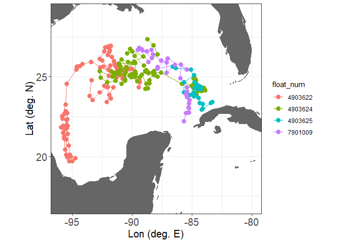
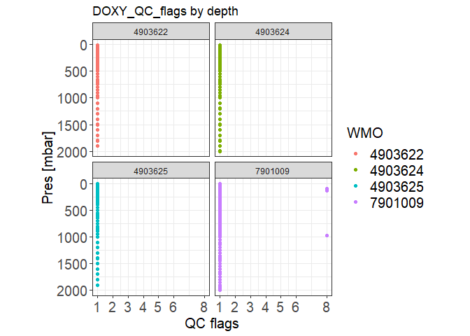
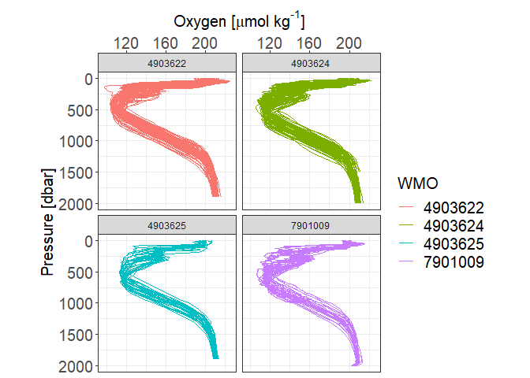

# Demo for OneArgoR101

Jennifer McWhorter & Marin Cornec (7/2/2024)

This demo shows how to handle the OneArgo toolbox and its basics functions.

The exercise aims to:  
1) Set the toolbox 
2) Select Oxygen data from four floats in the Gulf of Mexico
3) Extract those data from the GDAC under a dataframe
4) Plot the floats trajectories
5) Plot the flags of oxygen quality-controlled data
6) Plot the vertical profiles of oxygen from the selected floats

[OneArgo R toolbox](https://github.com/NOAA-PMEL/OneArgo-R/)

# BEFORE YOU START !!
Fill the path directory to the folder for the OneArgo toolbox at line 45

------------------------------------------------------------------------

# 1) Prepare the worsket

**Remove previous files from R before running the scripts below**

``` r
cat("\014")
rm(list = ls())
```


**Load libraries**

Load (and install, if necessary) libraries

```{r}
for (i in c("dplyr","ggplot2","lubridate","gridExtra","tidyverse","ggeffects")) {
  if (!require(i, character.only = TRUE)) {
    install.packages(i, dependencies = TRUE)
    library(i, character.only = TRUE)
  }
}
```

**Fill the path to the code directory**

``` r
path_code = "X:/YOUR/PATH/"
```

------------------------------------------------------------------------

# 2) Initialize the Toolbox

Code below set the working directory and references the OneArgo toolbox functions

``` r
setwd(path_code)
func.sources = list.files(path_code,pattern="*.R")
func.sources = func.sources[which(func.sources %in% c('Tutorial.R',"oneargo_r_license.R")==F)] 

if(length(grep("Rproj",func.sources))!=0){
  func.sources = func.sources[-grep("Rproj",func.sources)]
}

invisible(sapply(paste0(func.sources),source,.GlobalEnv))

aux.func.sources = list.files(paste0(path_code,"/auxil"),pattern="*.R")
invisible(sapply(paste0(path_code,"/auxil/",aux.func.sources),source,.GlobalEnv))
```

This function defines standard settings and paths and creates Index and Profiles folders in your current path. 
It also downloads the Sprof index file from the GDAC to your Index folder. 
The Sprof index is referenced when downloading and subsetting float data based on user specified criteria in other functions.

``` r
initialize_argo() 
```

    ## [1] "Note: 93 floats from Sprof index file do not have BGC sensors"
    ## [1] "2042 true BGC floats were found"
    ## [1] "16168 core and deep floats were found"

------------------------------------------------------------------------

# 3) Read in data from the DAC using the toolbox

**Select profiles based on time and geographical limits with specified sensor**

This example uses the Gulf of Mexico pilot array, with oxygen measurements variable DOXY), deployed in 2021.
The "mode" option indicates the type of data mode to be extracted:
‘R’: raw mode; ‘A’: adjusted;  ‘D’: delayed-mode; ‘RAD’: all modes (raw, delayed mode, adjusted).

This function will return the selection of floats WMO and profiles numbers.

For the variable selection, make sure to use the appropriated name of the available parameters:
 PRES, PSAL, TEMP, DOXY, BBP, BBP470, BBP532, BBP700, TURBIDITY, CP, CP660, CHLA, CDOM,
 NITRATE, BISULFIDE, PH_IN_SITU_TOTAL, DOWN_IRRADIANCE, DOWN_IRRADIANCE380, DOWN_IRRADIANCE412, 
 DOWN_IRRADIANCE443, DOWN_IRRADIANCE490, DOWN_IRRADIANCE555, DOWN_IRRADIANCE670, UP_RADIANCE, 
 UP_RADIANCE412, UP_RADIANCE443, UP_RADIANCE490, UP_RADIANCE555, DOWNWELLING_PAR, DOXY2, DOXY3

For the geographical selection, you can use <br>
- a box (lon_lim=c(min longitude, max longitude); lat_lim=c(min latitude, max latitude)<br>
- a polygon selection (lon_lim= vector a longitude values, lat_lim = vector of corresponding latitude values)<br>

For an overview of the available floats/parameters, we also recommend using either monitoring tools:<br>
- https://maps.biogeochemical-argo.com/bgcargo/ <br>
- https://fleetmonitoring.euro-argo.eu/dashboard?Status=Active <br>

``` r
GoM_BGC = select_profiles(lon_lim = c(-96, -80),
                          lat_lim = c(17, 29),
                          start_date='2021-10-01',
                          end_date='2024-04-22',
                          sensor=c('DOXY'),
                          mode = 'RAD') 
```

**Load the floats data**

This function will download and extratct the data for the selection of floats WMO and profiles

``` r
float_data = load_float_data(float_ids=GoM_BGC$float_ids,
                             float_profs=GoM_BGC$float_profs)
```

    ## [1] "Progress: 25 %"
    ## [1] "Progress: 50 %"
    ## [1] "Progress: 75 %"
    ## [1] "Progress: 100 %"

**Extract the DOXY profiles and create a dataframe with the data**

This function converts the original list format of the data to a dataframe format.

A selection of flags measurements need to be specified (qc_flags).
1) good data
2) probably good data
3) probably bad data
4) bad data
5) value changed
6) _not attributed_
7) _not attributed_
8) interpolated data
9) no data<br>
QC 1,2,5,8 are the safer to use

The 'raw' option defines which data mode should be used for the chosen variable:<br>
raw = ‘yes_strict’, raw data only.<br> 
raw = ‘no’, adjusted data only.<br> 
raw = ‘yes’, raw data when adjusted data are not available.<br> 
raw = ‘no_strict’, skip the float if not all the variables are adjusted.

The "type" option defines how detailed will be output be:<br>
'cleaned'  : output will contain only the data with the requested QC (default)<br>
'detailed' : output will contain all the original data and additional columns<br> 
            with the corresponding QC.
			
The "mode" option, when set to TRUE (default) will add a column displaying the
data mode of the corresponding variable.<br>
(R = "Real Time", A= "Adjusted, D= "Delayed")

``` r
float_data_qc = qc_filter(float_data$Data,
                          variables = c('DOXY'),
                          qc_flags = c(1:8),
                          raw='yes', 
                          format='dataframe',
                          type='detailed', 
                          mode = T)
```

    ## Warning in qc_filter(float_data$Data, variables = c("DOXY"), qc_flags = c(1, :
    ## adjusted values for DOXY are not available

**Remove lines with no data (NA) in the dataframe**

``` r
float_data_qc_na<-unique(na.omit(float_data_qc)) 
```

**Clean up the WMOID** 
Remove the f from the number (f4903625 to 4903624)

``` r
float_data_qc_na$float_num<-substr(float_data_qc_na$WMOID,2,8) 
```

**Print the WMO of the floats available in the dataframe**

``` r
unique(float_data_qc_na$float_num)
```

    ## [1] "4903622" "4903624" "4903625" "7901009"

------------------------------------------------------------------------

# 4) Plot the float trajectories

**Set up base map**

``` r
mapWorld <- borders("world", colour="gray40", fill="gray40") # create a layer of borders
```

**Set map limits2**

``` r
lons = c(-96, -80)
lats = c(17, 29)
```

**Plot map of the float locations**

``` r
p_map <- ggplot(data=float_data_qc_na,
                aes(x=LONGITUDE, 
                    y=LATITUDE, 
                    color = float_num, 
                    group=float_num))+
  geom_path() +
  geom_point(size = 3) +
  coord_cartesian(xlim = lons, ylim = lats) +
  ylab("Lat (deg. N)")+
  xlab("Lon (deg. E)")+
  theme_bw() +
  theme(axis.text.x = element_text(size = 15), 
        axis.title.x = element_text(size = 15), 
        axis.text.y = element_text(size = 15), 
        axis.title.y = element_text(size = 15),
        aspect.ratio = 1)+
  mapWorld

p_map
```



------------------------------------------------------------------------

# 5) Plot quality control data

``` r
p_DMQC <- ggplot(float_data_qc_na,
                 aes(y=PRES, 
                     x=DOXY_QC, 
                     color = float_num)) + 
  facet_wrap(~float_num) +
  geom_point(aes())+
  theme_bw() +
  ggtitle('DOXY_QC_flags by depth') +
  scale_y_reverse(limits=c(2000,5)) +
  labs(colour="WMO",x="QC flags", y="Pres [mbar]")+
  scale_x_continuous(breaks=c(1,2,3,4,5,6,8)) +
  theme(axis.text.x = element_text(size = 15), 
        axis.title.x = element_text(size = 15), 
        axis.text.y = element_text(size = 15), 
        axis.title.y = element_text(size = 15), 
        legend.text  = element_text(size = 15), 
        legend.title = element_text(size = 15), 
        aspect.ratio=1) 

p_DMQC
```

    ## Warning: Removed 54 rows containing missing values (`geom_point()`).



------------------------------------------------------------------------

# 6) Plot profiles

``` r
p1 <- ggplot(data=float_data_qc_na, aes( x = DOXY, 
                                         y = PRES, 
                                         color = float_num, 
                                         group = CYCLE_NUMBER),
             orientation = "y") + facet_wrap(~float_num) +
  geom_path(linewidth = .1) +
  theme_bw() +
  theme(axis.text.x = element_text(size = 15), 
        axis.title.x = element_text(size = 15), 
        axis.text.y = element_text(size = 15), 
        axis.title.y = element_text(size = 15), 
        legend.text  = element_text(size = 15), 
        legend.title = element_text(size = 15), 
        aspect.ratio=1)+ 
  labs(colour="WMO")+
  scale_y_reverse(limits=c(2000,5)) +
  scale_x_continuous(position = "top") +
  labs(
    x = expression(paste("Oxygen [", mu, "mol kg"^"-1","]")),
    y = "Pressure [dbar]"
  )

p1
```

    ## Warning: Removed 4 rows containing missing values (`geom_path()`).



**Convert plot to a savable object**

``` r
g <- arrangeGrob(p1)
```

    ## Warning: Removed 4 rows containing missing values (`geom_path()`).

**Option to save out your plot below, just un-comment and change the file path**

``` r
#ggsave("X:/YOUR/PATH/plot_name.png", g, width=12, height=8)
```
